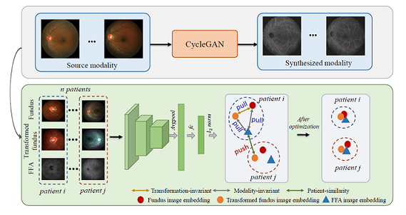

## TMI20: Self-supervised Feature Learning via Exploiting Multi-modal Data for Retinal Disease Diagnosis

Pytorch implementation 

## Paper
[Self-supervised Feature Learning via Exploiting Multi-modal Data for Retinal Disease Diagnosis.](https://ieeexplore.ieee.org/stamp/stamp.jsp?tp=&arnumber=9139411)
<br/>
IEEE Transactions on Medical Imaging, 2020
<br/>
<br/>
<p align="center">
  
</p>

## Installation

* Install Python 3.7.4, Pytorch 1.1.0, torchvision 0.3.0 and CUDA 9.0
* Or Check requirements.txt
* Clone this repo
```
git clone https://github.com/xmengli999/self_supervised
cd self_supervised
```

## Data Preparation
* Download [Ichallenge-AMD dataset](https://drive.google.com/file/d/1ti0ozvMHCnq-PCX_CVc-Da98uJNmla8T/view?usp=sharing), 
[synthesized FFA](https://drive.google.com/file/d/1ti0ozvMHCnq-PCX_CVc-Da98uJNmla8T/view?usp=sharing) and 
[file_index](https://drive.google.com/file/d/1ts-Y8ePh_K_ijmBK8v3OfMIOhKMw-PSj/view?usp=sharing) <br/>
* Put them under `./data/`


## Evaluate 
* Download [our models](https://pan.baidu.com/s/1B6JK5ljhWz0V655obtX3og), password: gja3, and put it under `./savedmodels/`
* cd `scripts`
* Run `sh evaluate_fold.sh` to start the evaluation process
* 5-fold cross-validation results: 

| AUC    | Accuracy   | Precision    |
| ---------- | :-----------:  | :-----------: |
| 74.58%    | 86.58%   | 83.2%     |

## Train 
* cd `scripts`
* Run `sh train_fold.sh` to start the training process
* See `train_ablation.sh` for ablation study
* See `supervised_fundus.py` for supervised baselines

## Note
* Contact: Xiaomeng Li (xmengli999@gmail.com)
